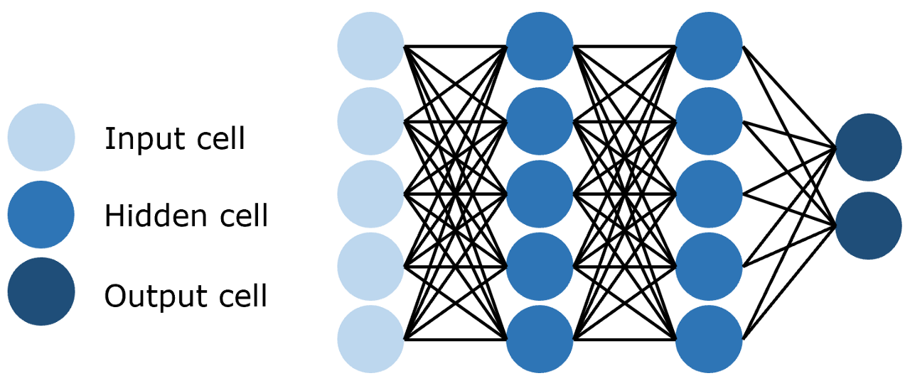

# Transformer

[Attention Is All You Need](https://arxiv.org/pdf/1706.03762)算是始祖文章了，每个搞AI深度学习玩意的人都知道，算是业内小儿科了,下面都基于这篇文章讲解，代码由AI生成。

<div align='center'>

</div>

涉及到的内容有：[Embedding](#embedding)，[PE](#位置编码)，[Attention](#注意力机制)，[FNN](#前馈神经网络fnn)，[Norm](#层归一化)，[train](#训练与预测)等

## Embedding

将自然语言的输入转化为向量，输入Embedding网络之前，现要经过分词器tokenizer，将语言切分为token并变成一个固定的index。分词的方法有很多种，比如这里采用的BPE。Embedding内部就是一个可训练的 $(Vocabsize,embeddingdim)$ 的权重矩阵，将输入 $(batchsize,seqlen,1)$ 转变为 $(batchsize,seqlen,embeddingdim)$.

## 位置编码

注意力机制中每个位置是平等的，transformer采用正余弦位置编码机制，保留序列中的相对位置信息。这个位置信息其实还可以通过学习的方式弥补，其他模型中有例子。

$$
\begin{aligned}
    PE(pos,2i)
    &=sin(\frac{pos}{10000^{\frac{2i}{d_{model}}}}) \\
    PE(pos,2i+1)
    &=cos(\frac{pos}{10000^{\frac{2i}{d_{model}}}})
\end{aligned} 
$$

就是在向量上加上一个位置相关的值，奇数维度用 $cos$ ，偶数维度用 $sin$ 。这样编码可以适应不同长度的句子，并且模型可以计算出相对位置，对于固定长度的间距 $k$ ，$PE(pos+k)$ 可以用 $PE(pos)$ 计算得到。因为 $Sin(A+B) = Sin(A)Cos(B) + Cos(A)Sin(B)$ , $Cos(A+B) = Cos(A)Cos(B) - Sin(A)Sin(B)$ 。不过这种相对位置还是不够直接，现在多采用的大概是 $ROPE$ ，直接将相对位置融入注意力计算中，这里不做介绍。

##  注意力机制

三个核心变量：查询值 $Query$ ，键值 $Key$,真值 $Value$ . 假设我们现在已经有键值对如下:

```json
{
    "apple":0.6,
    "banana":0.4,
    "chair":0
}
```

表示每种水果对应的分数，现在我们想要知道 "fruit" 这个词的分数是多少。将 "fruit" 当作 $Q$ ，去和 $K$ 做点积运算得到相似度，归一化后去和 $V$ 做计算就得到了我们要查询的 $Q$ 的值。

实际实现 $Q,K,V$ 都是矩阵，需要加上 $softmax$ 归一化和缩放点积 $\sqrt{d_{k,v}}$

$$
\begin{aligned}
softmax(x)_{i}
&=\frac{e^{x^i}}{\sum_{j}e^{x_j}} \\
attention(Q,K,V)
&=softmax(\frac{QK^T}{\sqrt{d_{k,v}}})V
\end{aligned}
$$

注意 $softmax$ 操作是在行维度进行的。

### 自注意力

注意力机制的本质是俩段序列进行相似度计算，基于相似度分配得到真值。自注意力就是 $Q,K,V$ 都来源与一段序列，通过不同的参数矩阵 $W_{q},W_{k},W_{v}$ 做积得到，从而拟合序列中每个token与其他所有token的关系。

$$
\begin{aligned}
Q &= XW_{Q} \\
K &= XW_{K} \\
V &= XW_{V} \\
attention(Q,K,V)
&=softmax(\frac{QK^T}{\sqrt{d_{k,v}}})V
\end{aligned}
$$

### 掩码自注意力

原来的自注意力是拟合一个token与其他所有token的关系，掩码自注意力是拟合一个token与它之前的token的关系，屏蔽未来的信息。

其实就是把注意力矩阵变为下三角矩阵，上三角给予一个极低的值，这样在  $softmax$ 之后就不会被关注到。

```markdown
<BOS> 【MASK】【MASK】【MASK】【MASK】
<BOS>    I   【MASK】 【MASK】【MASK】
<BOS>    I     like  【MASK】【MASK】
<BOS>    I     like    you  【MASK】
<BOS>    I     like    you   </EOS>
```

实践中通过生成一个维度为 $(1,seqlen,seqlen)$ 的上三角矩阵，加到注意力矩阵中来实现。

$$
\begin{aligned}
attention(Q,K,V)
&=softmax(Mask(\frac{QK^T}{\sqrt{d_{k,v}}}))V
\end{aligned}
$$

### 多头注意力  MHA

所谓的多头注意力机制就是将原始的输入序列进行多组的自注意力处理，每组注意力的结果特征维度为 $\frac{d_{model}}{h}$ ,然后将每一组得到的自注意力结果凭借起来，再经过一个线性层处理得到最终输出。

$$
\begin{aligned}
MHA(Q,K,V)
&=Concat(head_1,\ldots,head_h)W^O \\
head_i
&= attention(QW^{Q}_{i},KW^{K}_{i},VW^{V}_{i})
\end{aligned}
$$

实际实现上不用增加不同的参数矩阵，可以将不同参数矩阵拼接到一个矩阵，再进行内积。

$$
QKV=[B,S,D]\rightarrow [B,S,h,hd]\rightarrow attention\rightarrow X=[B,S,D]
$$

## 前馈神经网络FNN

即全连接神经网络

<div align='center'>

</div>

由参数矩阵 $W$ （线性层）和激活函数 $F$ 构成，transformer采用 $RELU$ 激活函数，俩层线性变化。

$$
FNN(x)=max(0,xW_1+b_1)W_2+b_2
$$

## 归一化

常见归一化有三种: $LayerNorm,BatchNorm,RMSNorm$

**Layer Normalization (LayerNorm):**

$$
\begin{aligned}
\mu &= \frac{1}{d}\sum_{i=1}^{d}x_i \\
\sigma^2 &= \frac{1}{d}\sum_{i=1}^{d}(x_i - \mu)^2 \\
LayerNorm(x) &= \gamma \cdot \frac{x - \mu}{\sqrt{\sigma^2 + \epsilon}} + \beta
\end{aligned}
$$

**Batch Normalization (BatchNorm):**

$$
\begin{aligned}
\mu_B &= \frac{1}{m}\sum_{i=1}^{m}x_i \\
\sigma_B^2 &= \frac{1}{m}\sum_{i=1}^{m}(x_i - \mu_B)^2 \\
BatchNorm(x) &= \gamma \cdot \frac{x - \mu_B}{\sqrt{\sigma_B^2 + \epsilon}} + \beta
\end{aligned}
$$

**RMS Normalization (RMSNorm):**

$$
\begin{aligned}
RMS &= \sqrt{\frac{1}{d}\sum_{i=1}^{d}x_i^2} \\
RMSNorm(x) &= \gamma \cdot \frac{x}{RMS + \epsilon}
\end{aligned}
$$

其中：
- $\gamma$ 和 $\beta$ 是可学习的缩放和偏移参数
- $\epsilon$ 是防止除零的小常数（通常为 $10^{-5}$ ）
- $d$ 是特征维度， $m$  是批次大小
- LayerNorm在特征维度上归一化，BatchNorm在批次维度上归一化
- RMSNorm省略了均值计算，只使用均方根进行归一化

transformer采用的是 $LayerNorm$

## 残差连接

残差连接允许信息直接从前一层传递到后一层，有效缓解深层网络的梯度消失问题。

**基本残差连接：**

$$
y = x + F(x)
$$

**Transformer中的残差连接：**

$$
\begin{aligned}
\text{输出} &= LayerNorm(x + Sublayer(x)) \\
\text{其中} \quad Sublayer(x) &= \begin{cases}
MHA(x) & \text{注意力层} \\
FNN(x) & \text{前馈网络层}
\end{cases}
\end{aligned}
$$

**作用：**
- 缓解梯度消失：梯度可以直接通过恒等映射传播
- 加速训练：提供梯度的快速传播路径
- 保持信息：确保原始信息不会在深层传播中丢失
- 稳定训练：使深层网络更容易优化

## $Encoder$ 和 $Decoder$

$Encoder$ 由 $N$ 个 $EncoderLayer$ 组成，每个 $EncodeLayer$ 包括一个 $MHA$ 和 $FNN$ . $DecoderLayer$ 包含 $Mask MHA$, $MHA$ , $FNN$ .其中  $Decoder$ 中的 $KV$ 来自于 $Encoder$

$$
EncodeLayer(X)\\
X=LayerNorm(X+MHA(X)) \rightarrow \\
X=LayerNorm(X+FNN(X)) \\
DecoderLayer(X)\\
Q=X=LayerNorm(X+Mask MHA(X)) \\
X=LayerNorm(X+MaskMHA(Q,K,V)) \\
X=LayerNorm(X+FNN(X))
$$

## 训练与预测

### 训练过程

**损失函数（交叉熵）：**

$$
\mathcal{L} = -\frac{1}{N}\sum_{i=1}^{N}\sum_{j=1}^{|V|} y_{i,j} \log(\hat{y}_{i,j})
$$

其中 $y_{i,j}$ 是真实标签的one-hot编码，  $\hat{y}_{i,j}$  是模型预测的概率分布。

**Teacher Forcing训练：**
- 训练时将真实目标序列作为Decoder输入
- 并行计算所有位置的损失，加速训练
- 使用掩码确保每个位置只能看到之前的token

**优化器：**
- Adam优化器，学习率预热(Warmup)策略
- $lr = d_{model}^{-0.5} \cdot \min(step^{-0.5}, step \cdot warmup\_steps^{-1.5})$

### 预测过程

**自回归生成：**

$$
\begin{aligned}
P(y_1, y_2, ..., y_T | x) &= \prod_{t=1}^{T} P(y_t | y_{<t}, x) \\
y_t &= \arg\max P(y_t | y_{<t}, x)
\end{aligned}
$$

**预测步骤：**
1. Encoder处理输入序列得到表示
2. Decoder逐步生成，每次预测下一个token
3. 将预测的token加入序列，继续预测
4. 直到生成结束标记`<EOS>`或达到最大长度

**解码策略：**
- **贪心解码**：每步选择概率最大的token
- **束搜索(Beam Search)**：保持多个候选序列，选择全局最优
- **采样解码**：根据概率分布随机采样，增加多样性


