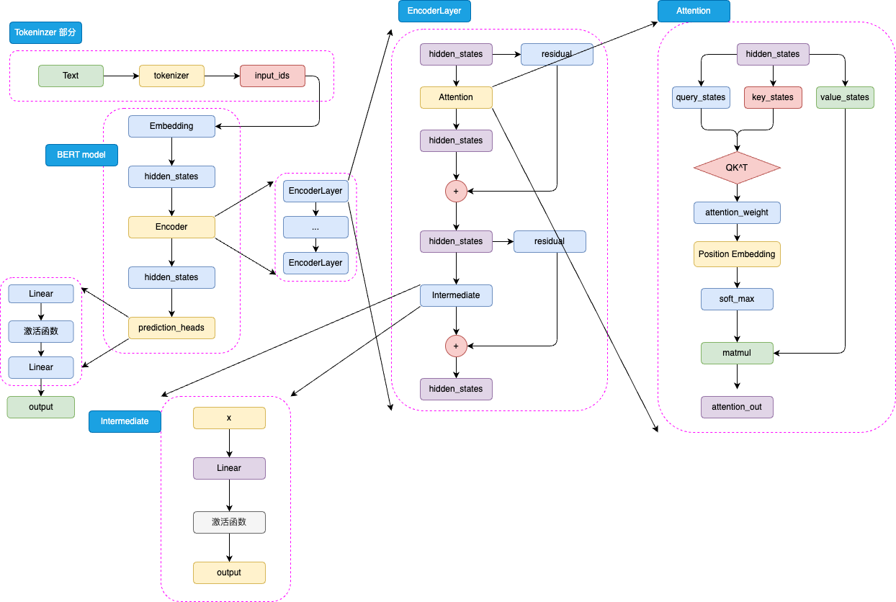
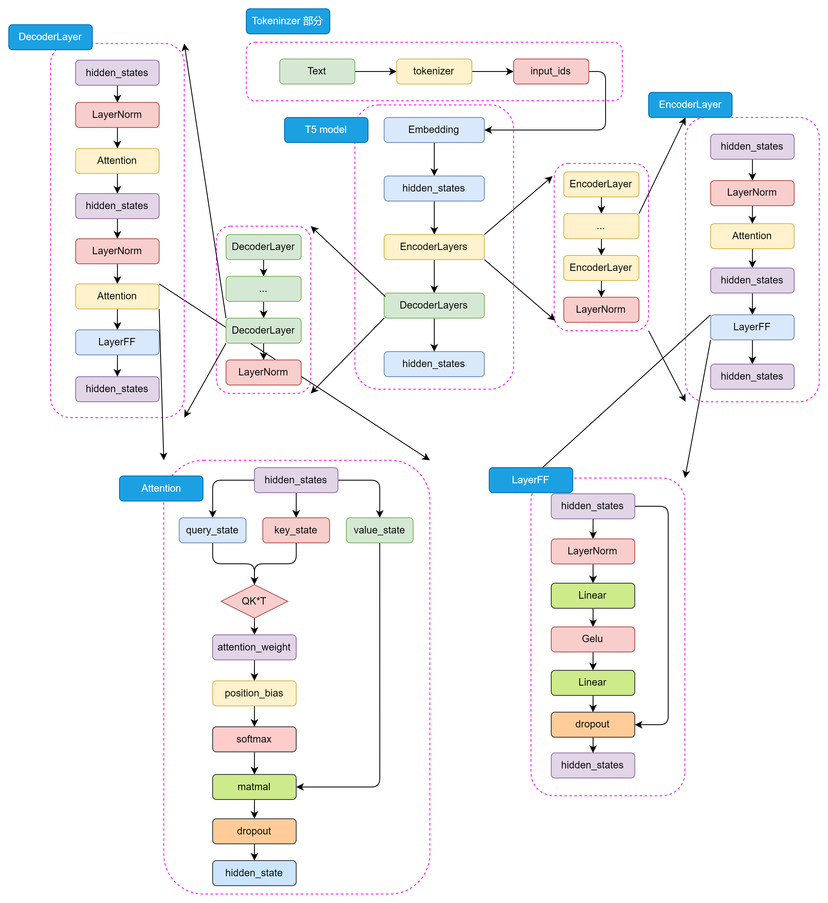
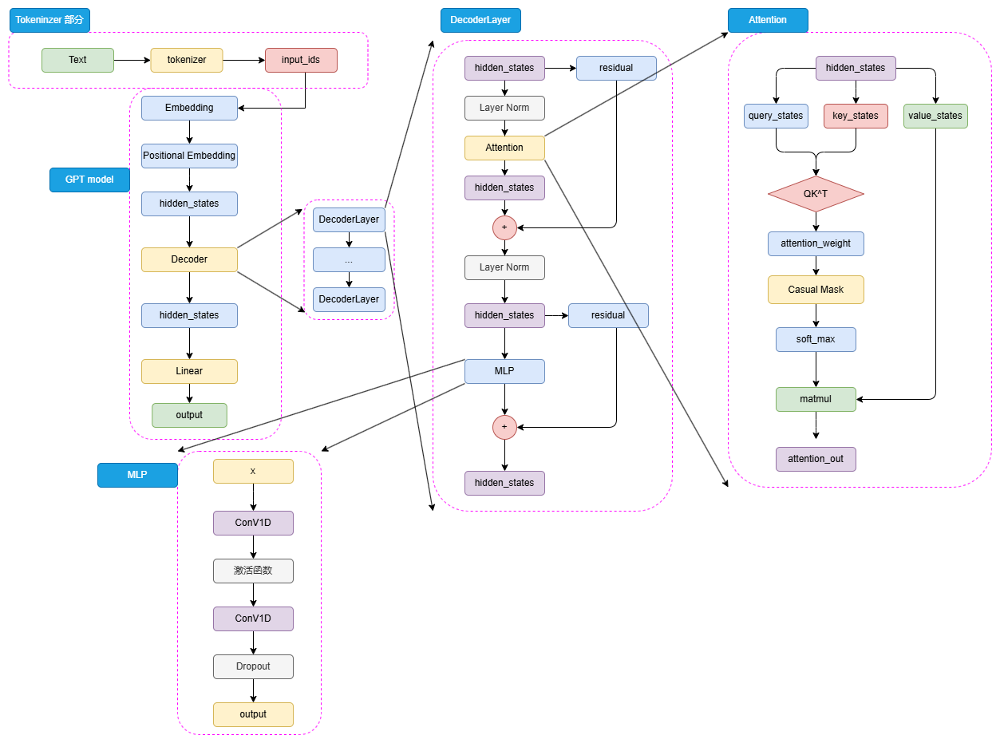
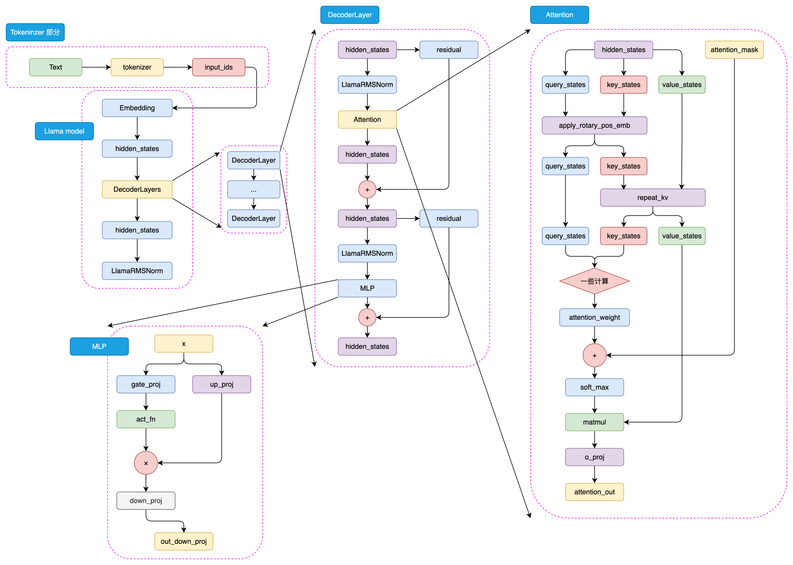

# 预训练语言模型

[Encoder-only](#encoder-only)-[Encoder-Decoder](#encoder-decoder)-[Decoder-only](#decoder-only)

## Encoder-only

只使用Encoder的模型，通常在 NJU 任务中使用。开创了预训练＋微调的范式

### BERT

1. **模型架构**
    BERT是针对 NJU 任务打造的预训练模型，输入一般是文本序列，输出为label。为适配各种NJU任务，在模型的顶层加入了一个分类头prediction_heads，从隐藏状态通过线性层转换到分类维度

    * tokenizer: BERT 采用 **WordPiece** 作为字词切分算法。
    * 激活函数： $GELU(x)=0.5x(1+tanh(\sqrt{\frac{2}{\pi}}))(x+0.044715x^3)$ . GELU 将随即正则的思想引入激活函数，通过输入自身的概率分布决定抛弃还是保留自身的神经元。 //TODO
    * 可学习的位置编码，在注意力 $QK^T$ 计算后增加一层线性矩阵，拟合相对位置。增加了大量参数，也意味着无法处理超过训练长度的输入。

2. **预训练任务--MLM+NSP**

* MLM

    在文本序列中随机遮蔽部分token，然后将所有未被遮蔽的token输入模型，要求模型根据未被遮蔽的token预测被遮蔽的token

    在具体进行 MLM 训练时，会随机选择训练语料中 15% 的 token 用于遮蔽。但是这 15% 的 token 并非全部被遮蔽为 <MASK>，而是有 80% 的概率被遮蔽，10% 的概率被替换为任意一个 token，还有 10% 的概率保持不变。

* NSP

    下一个句子预测：输入一个句对，判断俩个句子是否是连续的上下文。 NSP 的正样本可以从无监督语料中随机抽取任意连续的句子，而负样本可以对句子打乱后随机抽取（只需要保证不要抽取到原本就连续的句子就行）。

3. **下游任务微调**

    对每一个输入的文本序列，BERT 会在其首部加入一个特殊 token <CLS>。在后续编码中，该 token 代表的即是整句的状态，也就是句级的语义表征。在进行 NSP 预训练时，就使用了该 token 对应的特征向量来作为最后分类器的输入。

    针对下游任务如序列标注文本生成等，可以直接用BERT的输出或者修改模型结构中的prediction_heads部分
### RoBERTa

1. **预训练任务**

    去掉了NSP，并对MLM做了改进，就是在训练的每个Epoch进行动态遮蔽策略，从而使每个Epoch的Mask都不一样。

2. **更大规模预训练数据和步长**

    更大的batchsize和序列长度512

3. **更大的BPE词表** 
    RoBERTa采用**BPE字节对编码**进行自此切分，获得的词表更大。

### ALBERT

尝试降低模型参数并提出新预训练任务SOP

1. **将Embedding参数进行分解**

    原来的Emdedding层矩阵维度： $V*H$ ，参数量很大，添加一个中间层 $E$ ，且远小于 $H$ ，Embedding层维度减小到了 $V*E+E*H$  

2. **跨层参数共享**

    仅初始化一个 $EncoderLayer$ ，进行24次计算。减小了参数，训练效率并未增加。

3. **SOP预训练任务**

    在NSP任务中，正例是俩个连续句子的句对，负例是任意俩篇文档抽取的句对。NOP任务做了改进，将负例改为正例句对的翻转

## Encoder-Decoder

### T5

1. **模型结构:Encoder-Decoder**
    
    * **RMSNorm**: $RMSNorm(x)=\frac{x}{\sqrt{\frac{1}{n}\sum_{i=1}^n x_{i}^{2}+\epsilon}} \cdot \gamma$
    * **self-attention+FNN**：与Transformer相似，具体看模型图
2. **预训练任务**

    **MLM**：输入文本中随机遮蔽15%的token，用特殊的占位符替代，然后将遮蔽的token作为模型的输出目标。文本到文本

## Decoder-only

### GPT

1. **模型架构** 
    * $PE$ ：正余弦位置编码
    * $Mask Attention$ 与$LayerNorm$ ：$MAtention(LayerNorm(X))+X$ 修改了$LayerNorm$ 的位置。这些改动的核心原因在于，由于模型层数增加、体量增大，梯度消失和爆炸的风险也不断增加，为了使模型梯度更稳定对上述结构进行了优化。
    * $MLP$ :俩个一维卷积核 $ConV1D$ 

2. **预训练任务--CLM**
    Csaual language Model,可看作是 N-gram 的扩展， N-gram 是基于前 N 个token预测下一个 token， CLM 基于前面所有 token 预测下一个 token

### LLaMA

* 模型架构 
    * **$GQA$** 分组查询注意力：查询 $Q$ 有很多个，$KV$ 少，需要 $repeat KV$
    * **$ROPE$**:旋转位置编码，具体实现//TODO
    * **$MLP$**:带有门控机制, $gateproj$ 和 $upproj$

### GLM

1. **模型架构**
    * $Pre Norm$ 改为 **$Post Norm$**
    * **$MLP$** 改为单个线性层
    * **激活函数** $ReLU\rightarrow GeLUs$
2. **预训练任务-GLM**

    自回归空白填充：对于一个输入序列，每次随机遮蔽一连串token，训练时，既需要使用遮蔽部分的上下文预测遮蔽部分，遮蔽部分内部又需要以CLM的方式完成。

    主要在预训练模型时代，现在已经out.主流还是 CLM