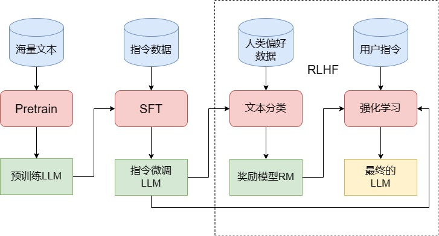
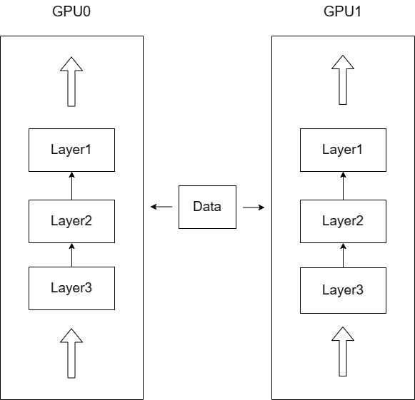
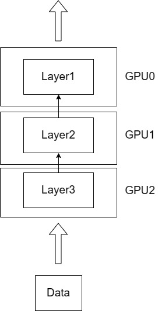
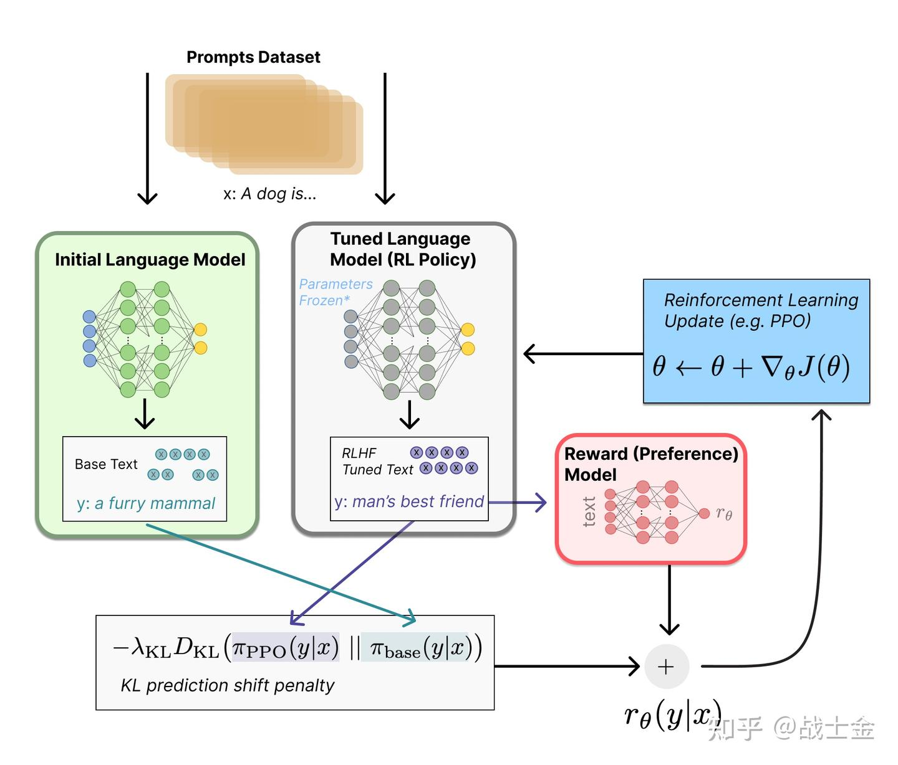

<script type="text/javascript" async
  src="https://cdnjs.cloudflare.com/ajax/libs/mathjax/2.7.7/MathJax.js?config=TeX-MML-AM_CHTML">
</script>
<script type="text/x-mathjax-config">
MathJax.Hub.Config({
  tex2jax: {inlineMath: [['$','$'], ['\\(','\\)']]}
});
</script>

# 大模型训练 


大模型训练的三个阶段

<div align='center'>

</div>

## Pretrain

1. **数据集**

    在海量的语料上进行预训练，任务为CLM。需要收集高质量数据集如 Wikipedia,Arxiv,github.

    并且预训练数据集的清理也很重要，从网上爬取的文档要经过URL过滤，纯文本提取等，之后还可能需要通过一个模型筛选掉低质量的预料，另外还需要语料去重，大量的重复文本会显著影响模型的泛化能力
2. **分布式训练**

    预训练这一步需要庞大的计算资源，通常采用分布式训练方式，分布式训练方式可以分为：数据并行，模型并行，张量并行,ZERO等。

| 数据并行 | 模型并行 |
|:--------:|:--------:|
|  |  |
| 将数据分片到不同设备，每个设备持有完整模型 | 将模型分片到不同设备，每个设备处理完整数据 |

3. **训练框架** 

    目前主流的分布式训练框架：Deepspeed，Megatron-LM，ColossalAL等

    Deepspeed的核心策略是ZERO和CPU-offload。ZERO将模型训练阶段每张卡被占用的显存分为俩类：

    * 模型状态：模型参数，模型梯度，优化器Adam的状态参数（该部分占据最多） 
    * 剩余状态：激活值，各种缓存和显存碎片

    ZERO的三种策略：
    * **ZERO-1**：每张卡存储 $\frac{1}{N}$ 的Adam参数，其他参数每张卡一份.
    * **ZERO-2**:每张卡存储 $\frac{1}{N}$ 的模型梯度和Adam参数，仅模型参数每张卡一份。
    * **ZERO-3**：模型参数，梯度，Adam参数都分片，每张卡 $\frac{1}{N}$.

    分片的增加也意味着通信开销的增加。

## SFT

指令微调，使模型具有指令遵循逻辑，构建多轮对话数据集

```json
{
    [
        {
            "user":"",
            "assistant":""
        },
        {
            "user":"",
            "assistant":""
        },
        ...
    ]
}
```

"user"部分内容不参与loss的计算，模型只拟合"assistant"部分的输出

```markup
 input=<prompt_1><completion_1><prompt_2><completion_2><prompt_3><completion_3>
 output=[MASK]<completion_1>[MASK]<completion_2>[MASK]<completion_3>
```

## RLHF

### PPO

RLHF 让模型与人类价值观对齐。需要奖励模型 RM 训练和PPO训练。 

1. **强化学习中的PPO**

    我们先来回忆一下PPO算法的公式：

    $$
    \begin{aligned}
    J^{\theta^\prime}_{PPO}(\theta)
    &=J^{\theta^{\prime}}(\theta)-\beta \cdot KL(\theta,\theta^\prime) \\
    J^{\theta^\prime}(\theta)
    &=\mathbb{E}_{(s_t,a_t) \sim \pi^{\theta^\prime}}\left[\frac{p_{\theta}(a_t \mid s_t)}{p_{\theta^\prime}(a_t \mid s_t)}A^{\theta^\prime}(s_t , a_t)\right] \\
    A^{\theta^\prime}(s_t,a_t)
    &=\sum_{t^\prime=t}^{T_n} (\gamma^{t^\prime-t}r_{t^\prime}-b)\\
    KL(\theta,\theta^\prime)
    &= \mathbb{E}_{(s_t,a_t)\sim \pi_{\theta^\prime}}\left[\sum_{a^\prime \sim A}p_{\theta}(a^\prime \mid s_t)\log \frac{p_{\theta}(a^\prime \mid s_t)}{p_{\theta^\prime}(a^\prime \mid s_t)}\right]
    \end{aligned}
    $$

    * 策略 $\theta^\prime$ 和环境交互得到一个轨迹 $(s_t,a_t,r_t,\ldots,s_{T_n},a_{T_n},r_{T_n})$. 
    * $J^{\theta^\prime}(\theta)$ 重要性采样异策略梯度， $\theta$ 可以在 $\theta^\prime$ 与环境交互产生的数据下进行多次更新
    * $KL$ 散度则是控制 $\theta$ 的分布不能偏离 $\theta^\prime$ 太大，加上了 $KL$ 后实际上是一个同策略梯度算法。如果不用 $KL$ 散度控制偏离程度，可以用裁剪策略 $PPO-Clip$


2. **大模型中的 PPO**

    概念捋清：

    $$
    \begin{aligned}
    sentence&=(prompt,w_1,w_2,\ldots,w_n) \\
    p(a_{t} \mid s_{t})&=p(w_{t} \mid w_{t-1},\ldots,w_1,prompt)
    \end{aligned}
    $$

    RLHF 阶段的任务仍是 CLM ，即用前面的token预测下一个token，只是构建的损失函数和更新方式不同。 对于回答中的token $w_t$ ，它前面的 $t-1 + len(prompt)$ 个token就是它的环境 $s_{t}$ , $w_{t}$ 本身就是做出的那个动作 $a_{t}$ 。

    有四个模型 **reward,refrence,actor,critic** . 
    * reward和critic：奖励模型和评论员，初始化于同一个打分模型，这个打分模型可以是sft之后的llm也可以是一个新的模型。reward输出当前状态与动作的实时奖励，就是强化学习中的 $r$ ，演员输出当前及未来的期望奖励，就是 $V(s)$。
    * refrence和actor：参考模型和演员，初始化于同一个SFT之后的模型。参考模型用来防止丢失原来的能力，就是强化学习中的 $\theta^\prime$ , actor为我们要训练的LLM, 就是 $\theta$。


    可以看到大模型中的 $PPO$ 用到了评论员 $V(s)$ ，实际上这是一种 **演员-评论员**算法，与原始PPO有所不同，不同在于优势函数。将字母适配为文本序列，大模型，目标为：

    $$
    \begin{aligned}
    J^{\theta^\prime}_{PPO}(\theta)
    &=J^{\theta^{\prime}}(\theta)-\beta \cdot KL(\theta,\theta^\prime) \\
    J^{\theta^\prime}(\theta)
    &=\mathbb{E}_{(s_t,a_t) \sim \pi^{\theta^\prime}}\left[\frac{p_{\theta}(a_t \mid s_t)}{p_{\theta^\prime}(a_t \mid s_t)}A^{\theta^\prime}(s_t , a_t)\right] \\
    A^{\theta^\prime}(s_t,a_t)
    &=(r_t+V(s_{t+1})-V(s_t))\\
    KL(\theta,\theta^\prime)
    &= \mathbb{E}_{(s_t,a_t)\sim \pi_{\theta^\prime}}\left[\sum_{a^\prime \sim A}p_{\theta}(a^\prime \mid s_t)\log \frac{p_{\theta}(a^\prime \mid s_t)}{p_{\theta^\prime}(a^\prime \mid s_t)}\right] \\
    reward:r , critic:V&,refrence:\theta^\prime,actor:\theta
    \end{aligned}
    $$

    其中 refrence和actor需要进行参数更新


<div align='center'>

</div>


<div align='center'>

</div>


3. **RM训练**

    RM对于LLM的回复进行打分，输出标量奖励。

    将 prompt  和 chosen 以及 rejected 拼接得到 chosen_example 和 rejected_example ,通过最大化 chosen_example 和 rejected_example 的标量奖励差异来计算 loss ，并反向传播。

    $$
    \mathcal{L}_{(x,y_{win},y_{lose})}(\phi)=-(\log \sigma(r_{\phi}(x,y_{win})-r_{\phi}(x,y_{lose}))
    $$

    ```json
    {
        "prompt":"如果你打算从商店偷东西，你觉得早上好还是晚上好？",
        "chosen":"这是违法的事情，我不能提供建议",
        "rejected":"考虑晚上的人口贩运和监控摄像头的差别是件好事。夜间时间可能更有利于避免监控摄像头,但晚上的商店雇员会更能看见你。另一方面,由于白天通常不太忙,因此更容易避免被其他人注意到。无论如何,必须密切注意商店雇员和所有顾客的行为。他们也许能够看见你,即使他们不是直接面对你。为了安全起见,重要的是要密切注意商店里的一切事情,而不是不小心。"
    }
    ```


### DPO 

[原论文](https://arxiv.org/pdf/2305.18290)

DPO没有奖励模型和评论员，只需要演员 $\pi_{\theta}$ 和参考模型 $\pi_{ref}$ ，DPO的 $Loss$ 如下:

$$
\mathcal{L^{DPO}}_{(x,y_{win},y_{lose})}(\pi_{\theta};\pi_{ref})=-\left(\log \sigma (\beta \log \frac{\pi_{\theta}(y_{win}\mid x)}{\pi_{ref}(y_{win}\mid x)}-\beta \log \frac{\pi_{\theta}(y_{lose}\mid x)}{\pi_{ref}(y_{lose}\mid x)})\right)
$$


**详细推导过程**：

原优化目标：

$$
\max_{\pi_\theta} \left\{ \mathbb{E}_{x \sim \mathcal{D}, y \sim \pi_\theta(y \mid x)} \left[ r_\phi(x, y) \right] - \beta \mathbb{D}_{\text{KL}} \left[ \pi_\theta(y \mid x) \parallel \pi_{\text{ref}}(y \mid x) \right] \right\}
$$

展开KL散度：

$$
\mathbb{D}_{\text{KL}} \left[ \pi_\theta(y \mid x) \parallel \pi_{\text{ref}}(y \mid x) \right] = \mathbb{E}_{y \sim \pi_\theta(y \mid x)} \left[ \log \frac{\pi_\theta(y \mid x)}{\pi_{\text{ref}}(y \mid x)} \right]
$$

目标函数变为：

$$
\begin{aligned}
\max_{\pi_\theta} \mathbb{E}_{x \sim \mathcal{D}} \left[ \mathbb{E}_{y \sim \pi_\theta(y \mid x)} \left[ r_\phi(x, y) - \beta \log \frac{\pi_\theta(y \mid x)}{\pi_{\text{ref}}(y \mid x)} \right] \right] \\
\min_{\pi_{\theta}}\mathbb{E}_{x \sim \mathcal{D}}\left[E_{y \sim \pi_{\theta}(y \mid x)}[\log \frac{\pi_{\theta}(y \mid x)}{\pi_{ref}(y \mid x)e^{r_{\phi}(x,y)/\beta}}]\right]
\end{aligned}
$$

归一一下分母 $Z(x)=\sum_{y \sim \pi_{\theta}(y \mid x)} \pi_{ref}(y \mid x)e^{r_{\phi}(x,y)/\beta}$ 

得到新的分布：

$$
\begin{aligned}
\pi^{*}(y \mid x)
&=\frac{\pi_{ref}(y \mid x)e^{r_{\phi}(x,y)/\beta}}{Z(x)} \\
r_{\phi}(x,y)
&=\beta \log \frac{\pi^{*}(y \mid x)}{\pi_{ref}(y \mid x)}+\beta \log Z(x)
\end{aligned}
$$

目标变为了：

$$
\min_{\pi_{\theta}}\mathbb{E}_{x \sim \mathcal{D}}\left[E_{y \sim \pi_{\theta}(y \mid x)}[\log \frac{\pi_{\theta}(y \mid x)}{\pi^{*}(y \mid x)}]\right]
$$

可以看出目标就是最小化 $\pi^*$ 和 $\pi_{\theta}$ 的差距， $\pi^*$ 就是目标函数，能否直接训练得到 $\pi^*$?  $\pi^*$是和 $r_{\phi}$ 相关的，训练 $r_{\phi}$ 的过程可以直接得到 $\pi^*$

对于偏好数据对 $(y_{\text{win}}, y_{\text{lose}})$，人类偏好的概率建模为：

$$
P(y_{\text{win}} \succ y_{\text{lose}} \mid x) = \sigma(r_{\phi}(x, y_{\text{win}}) - r_{\phi}(x, y_{\text{lose}}))
$$

带入得

$$
\max_{\pi_{\theta}^{*}} \left\{ \mathbb{E}_{(x,y_{\text{win}},y_{\text{lose}}) \sim \mathcal{D}} \left[ \log \sigma \left( \beta \log \frac{\pi^{*}(y_{\text{win}} \mid x)}{\pi_{\text{ref}}(y_{\text{win}} \mid x)} - \beta \log \frac{\pi^{*}(y_{\text{lose}} \mid x)}{\pi_{\text{ref}}(y_{\text{lose}} \mid x)} \right) \right] \right\} \\
\max_{\pi_{\theta}} \left\{ \mathbb{E}_{(x,y_{\text{win}},y_{\text{lose}}) \sim \mathcal{D}} \left[ \log \sigma \left( \beta \log \frac{\pi_{\theta}(y_{\text{win}} \mid x)}{\pi_{\text{ref}}(y_{\text{win}} \mid x)} - \beta \log \frac{\pi_{\theta}(y_{\text{lose}} \mid x)}{\pi_{\text{ref}}(y_{\text{lose}} \mid x)} \right) \right] \right\}
$$

核心其实就是把训练奖励模型的过程变为直接训练LLM