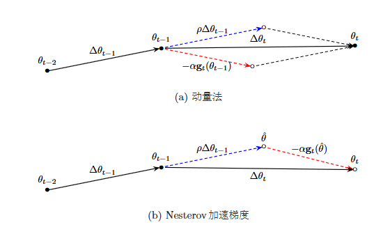
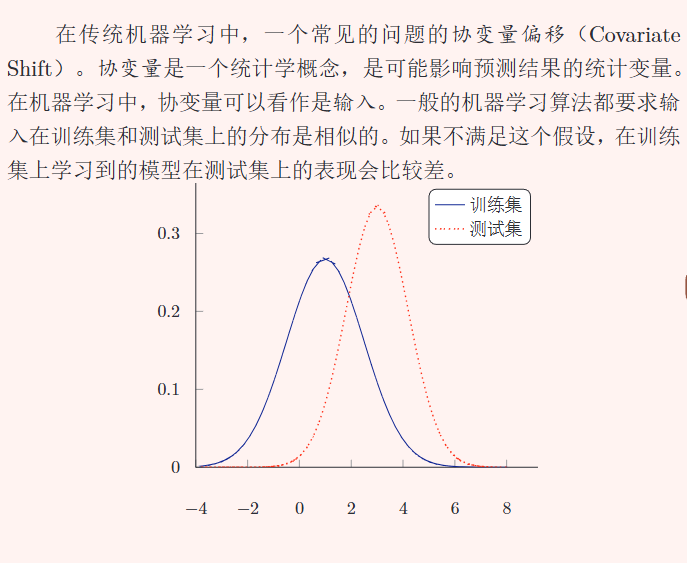
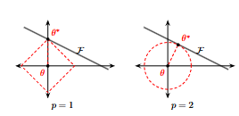

# 网络训练优化
神经网络的参数学习主要是通过梯度下降去最小化损失，如何更好更新参数，如何初始化参数。这是一个问题
## 优化算法

### 小批量梯度下降SGD 

神经网络 $f(x,\theta)$ ，在第 $t$ 次迭代中,选取 $K$ 个训练样本 $T_{t}=\{(x^{(k)},y^{(k)})\}_{k=1}^{K}$ ,损失函数关于参数的偏导数：

$$
{g}_{t}(\theta)=\frac{1}{K} \sum_{(x^{(k)},y^{(k)})\in T_{t}} \frac{\partial \mathcal{L}(y^{(k)},f(x^{(k)},\theta))}{\partial \theta}
$$

第 $t$ 次更新的梯度定义为 $\triangleq$ ${g}_{t}$ ,以及更新参数：

$$
\begin{aligned}
{g}_{t} &\triangleq {g}_{t}(\theta_{t-1})\\
\theta_t &\leftarrow \theta_{t-1} - \alpha {g}_t \\
\Delta \theta_{t} &\triangleq \theta_t-\theta_{t-1} \\
SGD \Delta \theta_{t} &= -\alpha g_{t}
\end{aligned}
$$

### 学习率衰减 

#### **固定衰减**：

初始学习率 $\alpha_0$ ，第 $t$ 次迭代的学习率 $\alpha_t$. 指数衰减：

$$
\alpha_{t}=\alpha_0 \beta^t
$$

#### **自适应衰减**：

根据不同参数的收敛情况分别设置学习率

**AdaGrad**,借鉴 L2 正则化的思想，在第 $t$ 次迭代时，先计算每个参数梯度平方的累计值：

$$
\begin{aligned}
G_t&=\sum_{\tau=1}^{t} g_{\tau} \odot g_{\tau} \\
\Delta \theta_t &= - \frac{\alpha}{\sqrt{G_t+\epsilon}} \odot g_t
\end{aligned}
$$

**RMSprop** 指数衰减移动平均, $G_t$ 的计算有变化：

$$
\begin{aligned}
G_{t}&=\beta G_{t-1} +(1-\beta) g_t \odot g_t \\
&=(1-\beta)\sum_{\tau=1}^{t}\beta^{t-\tau} g_\tau \odot g_\tau
\end{aligned}
$$

### 梯度方向优化 

#### **动量法**

用之前的累计动量替代真正的梯度，每次迭代的梯度可以看作是加速度。

第 $t$ 次迭代时，计算负梯度的加权移动平均，作为参数的更新方法:

$$
\Delta \theta_t = \rho \Delta \theta_{t-1} - \alpha g_t
$$

实际的参数更新方向 $\Delta \theta_t$ 为上一步的参数更新方向 $\Delta \theta_{t-1}$ 和当前梯度 $-g_t$ 的叠加。 当某个参数在最近一段时间内的梯度方向不一致，减缓梯度更新，当梯度方向一致时加速更新。

#### **Nesterov** 

加速梯度: 对动量法的改进。动量法参数更新其实理解俩个步骤：

$$
\begin{aligned}
\hat \theta &= \theta_{t-1} +\rho \Delta \theta_{t-1} \\
\theta_t &= \hat \theta =-alpha g_t \\
g_t &=g_t(\theta_{t-1})
\end{aligned}
$$

其中第二步的更新有些不太合理， $g_{t}$ 应该是针对 $\hat \theta$ 的。所以Nesterov修改并合并后的更新方向为：

$$
\Delta \theta_t=\rho \Delta_{t-1} -\alpha g_{t}(\theta_{t-1}+\rho \Delta \theta_{t-1})
$$

#### **AdaM**

可以看作是动量法和RMSprop的结合，不但使用动量作为参数更新方向，而且自适应调整学习率。一方面计算梯度平方 $g_t^2$ 的指数加权平均，另一方面计算梯度 $g_t$ 的指数加权平均:

$$
\begin{aligned}
M_t&=\beta_1 M_{t-1}+(1-\beta_1)g_t \\
&=(1-\beta_1)\sum_{\tau=1}^{t}\beta_1^{t-\tau}g_t\\
G_t&=\beta_2G_{t-1}+(1-\beta_2)g_t \odot g_t \\
&= (1-\beta_2)\sum_{\tau=1}^{t}\beta_2^{t-\tau}g_t \odot g_t
\end{aligned}
$$

$\beta_1 \beta_2$ 为俩个移动平均的衰减率，可分别取值为0.9，0.99。 $M_t$ 可以看作梯度的均值 (一阶矩) , $G_t$ 可看作是梯度的未减去均值的方差 (二阶矩)。假设 $M_0=0,G_0=0$ ，那么在初期 $G_t$ 和 $M_t$ 会偏小，因此进行修正：

$$
\begin{aligned}
\hat{M_t} &= \frac{M_t}{1-\beta_1^t} \\
\hat{G_t} &= \frac{G_t}{1-\beta_2^t} \\
\Delta \theta_t &= - \frac{\alpha}{\sqrt{\hat{G_{t}}+\epsilon}} \hat{M_t}
\end{aligned}
$$

$\Delta \theta_t$ 为参数更新差值，学习率 $\alpha$ 通常设为0.001，也可以进行衰减。上面几种方法可以相互融合。

## 参数初始化

#### Gaussian 初始化

参数固定均值和方差，以高斯分布初始化。比如，当一个神经元的输入连接数为 $n_{in}$ ，输出连接数 $n_{out}$ ，可以对输入连接权重以 $\mathcal{N}(0,\sqrt{\frac{1}{n_{in}}})$ 分布初始化，或者 $\mathcal{N}(0,\sqrt{\frac{2}{n_{in}+n_{out}}})$ 分布初始化。对输出连接权重同理

#### 均匀分布： Xaviter 初始化

以均匀分布 $[-r,r]$ 初始化 ，并自动计算超参数 $r$ .第 $l-1$ 到  $l$ 层， 神经元个数分别为 $n^{l-1}$ 和 $n^{l}$ 。对不同激活函数, $r$ 可以如下设置:

$$
\begin{aligned}
logistic:r&=\sqrt{\frac{6}{n^{l-1}+n^{l}}} \\
tanh:r&=4\sqrt{\frac{6}{n^{l-1}+n^{l}}}
\end{aligned}
$$

推导过程如下：

假设第 l  层的一个神经元为 $z^l$ , $z^l$ 接受前一层的 $n^{l-1}$ 个神经元的输出 $a_{i}^{(l-1)}$ , $i \in [1,n^{(l-1)}]$ . 参数初始化时要尽可能初始在激活函数的线性区间。

$$
\begin{aligned}
z^l &= \sum_{i=1}^{n^{(l-1)}} w_i^l a_i^{(l-1)} \\
a^l&=f(z^l) \approx z^l \\
var[a^l]&=var[\sum_{i=1}^{n^{(l-1)}}w_i^la_i^{(l-1)}] \\
&= n^{(l-1)} var[w_i^l]var[a_i^{(l-1)}] 
\end{aligned}
$$

要让 $var[a^l]=var[a^{l-1}]$ ,并且反向传播时也要满足，取一个折中的方案:

$$
\begin{aligned}
var[w_i^l]&=\frac{1}{n^{(l-1)}} \\
var[w_i^l]&=\frac{1}{n^l} \\
折中: var[w_i^l] &= \frac{2}{n^{(l-1)}+n^{(l)}} \\
var[w]&=\frac{(r-(-r))^2}{12} \\
r&=\sqrt{\frac{6}{n^{(l-1)}+n^{(l)}}}
\end{aligned}
$$

## 逐层归一化

归一化是为了解决协变量偏移的问题

### BN批量归一化
BN（Batch Normalization）对每一层的输入进行归一化，公式如下：

$$
\begin{aligned}
\mu_B &= \frac{1}{m} \sum_{i=1}^m x_i \\
\sigma_B^2 &= \frac{1}{m} \sum_{i=1}^m (x_i - \mu_B)^2 \\
\hat{x}_i &= \frac{x_i - \mu_B}{\sqrt{\sigma_B^2 + \epsilon}} \\
y_i &= \gamma \hat{x}_i + \beta
\end{aligned}
$$

### LN层归一化
LN（Layer Normalization）对每个样本的所有特征归一化，公式如下：

$$
\begin{aligned}
\mu &= \frac{1}{H} \sum_{j=1}^H x_j \\
\sigma^2 &= \frac{1}{H} \sum_{j=1}^H (x_j - \mu)^2 \\
\hat{x}_j &= \frac{x_j - \mu}{\sqrt{\sigma^2 + \epsilon}} \\
y_j &= \gamma \hat{x}_j + \beta
\end{aligned}
$$
## 网络正则化 

$\mathcal{l}_1$ 和 $\mathcal{l}_2$ 正则化

$$
\theta*=\arg\min_{\theta} \frac{1}{N}\sum_{n=1}^{N} \mathcal{L}(y^{(n)},f(x^{(n)},\theta))+\lambda\mathcal{l}_{p}
$$

等价于下面带约束条件的优化问题：

$$
\theta^*=\arg\min_{\theta}\frac{1}{N}\sum_{n=1}^{N}\mathcal{L}(y^{(n)},f(x^{(n)},\theta)) \\
subject \ to \  \mathcal{l}_p(\theta) \le 1
$$

$\mathcal{l}_1$ 正则化得到的最优解位于坐标轴上，得到稀疏解。此外 $\mathcal{l}_1$  范数零点不可导，可用 $\mathcal{l}_1(\theta)=\sum_i\sqrt{\theta_i^2+\epsilon}$ 近似