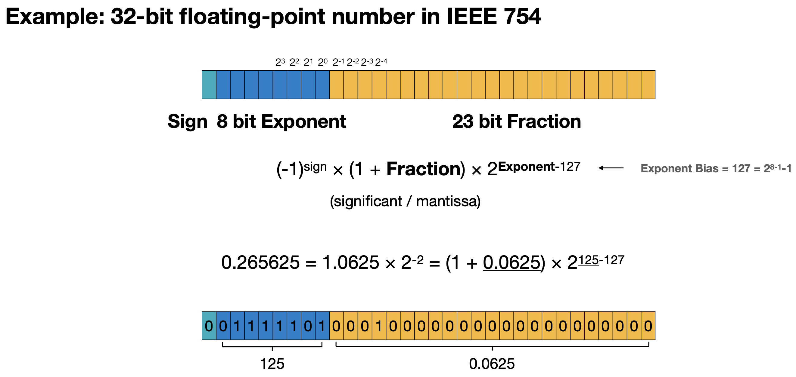
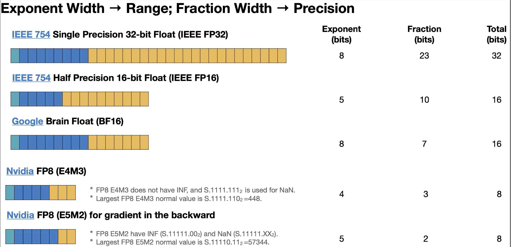
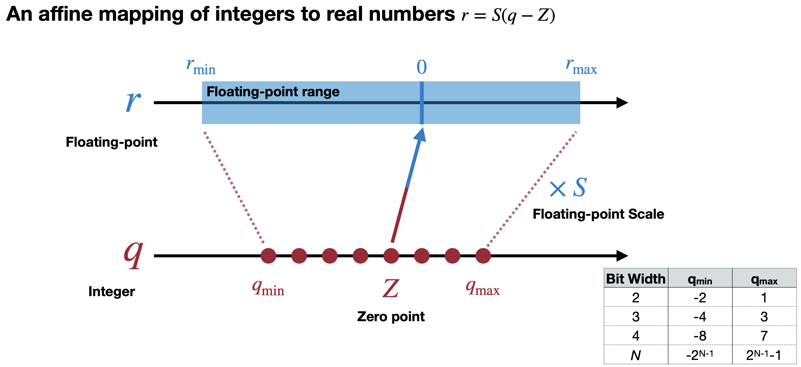
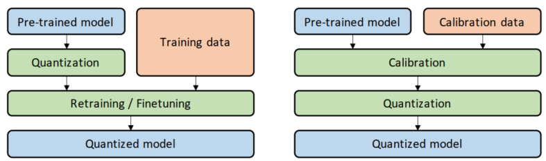
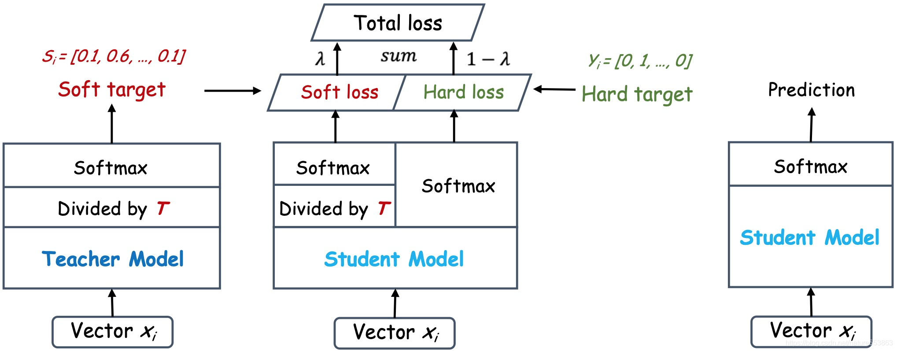
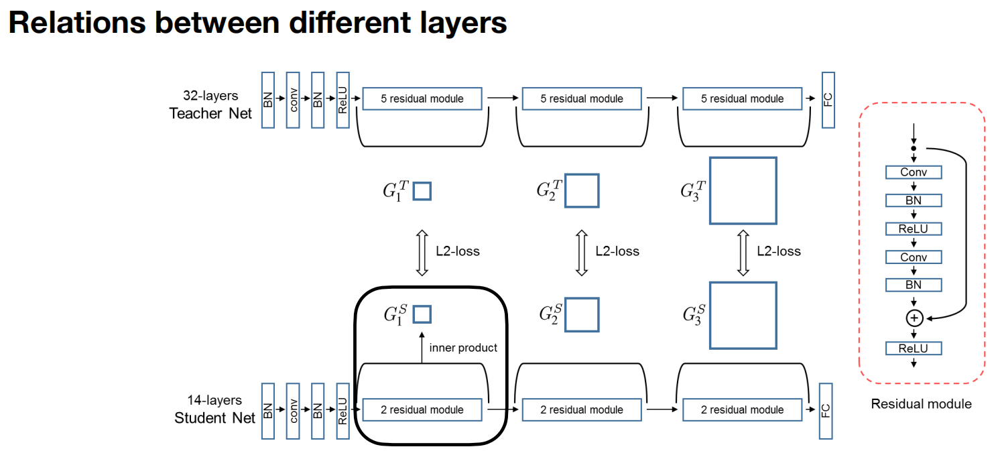

<script type="text/javascript" async
  src="https://cdnjs.cloudflare.com/ajax/libs/mathjax/2.7.7/MathJax.js?config=TeX-MML-AM_CHTML">
</script>
<script type="text/x-mathjax-config">
MathJax.Hub.Config({
  tex2jax: {inlineMath: [['$','$'], ['\\(','\\)']]}
});
</script>

# 模型压缩方法

介绍量化，知识蒸馏，低秩分解这几种模型压缩方法。并补充了数据类型的知识。

## 数据类型

### 进制转换

```
整数转二进制：除二取余法
13 ÷ 2 = 6  余 1  
6  ÷ 2 = 3  余 0  
3  ÷ 2 = 1  余 1  
1  ÷ 2 = 0  余 1   ← 停止
13->1101

小数转二进制：乘二取整法
0.1 × 2 = 0.2 → 0  
0.2 × 2 = 0.4 → 0  
0.4 × 2 = 0.8 → 0  
0.8 × 2 = 1.6 → 1  
0.6 × 2 = 1.2 → 1  
0.2 × 2 = 0.4 → 0  ← 开始循环！
0.1->000110011....
```


### 整型 (Integer)

数据位数 n
* 无符号整型：数据范围 $[0,2^n-1]$
* 有符号整型
  * 原码表示,取二进制左起第一位为符号位，0表示正数，1表示负数。数据范围： $[-2^{n-1}-1,2^{n-1}-1]$ 
  * 补码表示，左起第一位有符号表示还有权重，数据范围:  $[-2^{n-1},2^{n-1}-1]$  

### 定点数(Fixed Point Number)

表示小数数据时，把小数点位置固定在某个位置，相加策略。


### 浮点数(Floating Point Number)

计算的方式不是定点数那样单纯相加。fraction和exponent分别表示尾数位和指数位部分，分别决定了数据精度和表示范围。偏置 $bias=2^{(n-1)}-1$ $n$ 为指数位数

$$
fp32_{E8M23}=(-1)^{sign} \cdot (1+fraction)\cdot 2^{exponent-127}
$$

<div align='center'>

</div>

非正规浮点数,表示0的方法不一样。当exponent 为0 时，非正规浮点数表示：

$$
fp32_{E8M23}=(-1)^{sign}\cdot fraction\cdot 2^{(1-127)}
$$

也就是 exponent 的 0 是给非正规浮点数用的

$$
\begin{aligned}
fp16_{E5M10}&=(-1)^{sign}\cdot(1+fraction)\cdot2^{exponent-15} \\
bf16_{E8M7}&=(-1)^{sign}\cdot(1+fraction)\cdot2^{exponent-127} \\
fp8_{E4M3}&=(-1)^{sign}\cdot(1+fraction)\cdot2^{exponent-7} \\
fp8_{E5M2}&=(-1)^{sign}\cdot(1+fraction)\cdot2^{exponent-15} \\
\end{aligned}
$$

<div align='center'>

</div>

## 量化方法

### K-means量化

将weights聚类，每个weight变成聚类的索引值。例如将权重聚类为四类(0,1,2,3)，就可以实现 2-bit 的压缩.

<div align='center'>

</div>


### 线性量化

用 r 表示浮点实数， q 表示量化后的定点整数。浮点和整型之间的换算：

$$
\begin{aligned}
r &= S(q-Z) \\
q &= round(r/S+Z)
\end{aligned}
$$

$S$ 是量化放缩的尺度， $Z$ 是偏移量。根据 $Z$ 是否为0可将先行量化分为对称量化 $(Z=0)$ 和非对称量化 $(Z\neq 0)$。一个非对称量化如下：

$$
\begin{aligned}
S &= \frac{r_{max}-r_{min}}{q_{max}-q_{min}} \\
Z &= round(q_{max}-\frac{r_{max}}{S})
\end{aligned}
$$

<div align='center'>

</div>

### 训练后量化 PTQ
指在训练完成后，对模型进行量化，因此也叫做离线量化。根据量化零点是否为 0，训练后量化分为对称量化和非对称量化。根据量化粒度区分，训练后量化又分为**逐张量量化**和**逐通道量化**以及**组量化**。

### 量化感知训练 QAT
指在训练过程中，对模型添加模拟量化算子，模拟量化模型在推理阶段的舍入和裁剪操作，引入量化误差。并通过反向传播更新模型参数，使得模型在量化后和量化前保持一致。

<div align='center'>

</div>

## 知识蒸馏

<div align='center'>

</div>

知识蒸馏的损失函数由软损失和硬损失线性结合构成：

$$
\begin{aligned}
\mathcal{L}_{KL}&=KL(q(T),p(T))=\sum_{j}p_j(T)\log \frac{p_j(T)}{q_j(T)} \\
\mathcal{L}_{CE}&=CE(q(T=1),y)=\sum_j -y_j \log q_j(T=1)
\end{aligned}
$$

$p(\cdot)$ 和 $q(\cdot)$ 分别表示教师模型和学生模型， $T$ 是 $softmax$ 中的温度, $CE$ 表示交叉熵。最终的损失函数是这俩损失的线性组合。

还可以在中间层进行匹配：

<div align='center'>

</div>

## 低秩分解

矩阵的秩，列向量或行向量中线性无关的最大的数量。 r=\min(m,n) 为满秩 , r < min(m,n) 说明存在线性相关的向量，有冗余信息。低秩分解的目标：

$$
A \approx BC^{T} \\
A \in \mathbb{R}^{m \times n},B \in \mathbb{R}^{m \times k},C \in \mathbb{R}^{n \times k}
$$


### 奇异值分解(SVD)

任何一个秩为 $r$ 的juzhen $W \in \mathbb{R}^{m \times n}$ 都可以被分解为三个矩阵的乘积：

$$
W=U \Sigma V^{T}
$$

* $U \in \mathbb{R}^{m \times m}$ 是一个正交矩阵，其列向量 $u_i$ 被称为左奇异向量
* $\Sigma \in \mathbb{r}^{m \times n}$ 是一个对角矩阵，其对角线的元素 $\sigma_1,\sigma_2,\cdots,\sigma_r$ 非负且按从大到小的顺序排列 $\sigma_1 \geq \sigma_2\cdots\geq \sigma_r \geq 0$ ，被称为奇异值 
* $V^T \in \mathbb{R}^{n \times n}$ 也是正交矩阵，其行向量被称为右奇异向量。

其实就相当于方阵的特征值分解。我们可以取前k个奇异值对应的奇异向量组成矩阵。

还有很多别的分解算法，但是奇异值分解是理论基础。


资源 
https://github.com/liguodongiot/llm-action?tab=readme-ov-file
https://datawhalechina.github.io/llm-deploy/#/_sidebar
https://github.com/datawhalechina/awesome-compression?tab=readme-ov-file

